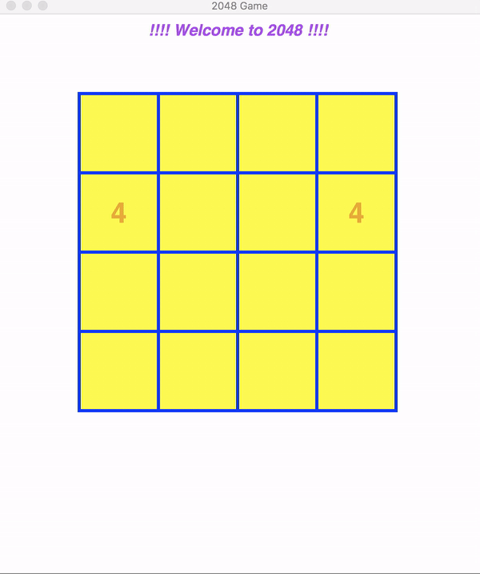

# 2048

This is a Single Player game in which final aim is to achieve a cell of value **2048**. In each move player can move all cells left, right, up and down, and if there are two cells of same value are touching by edge then they will merge and form one cell of double value in direction of movement of cells. All other cells will move in the direction selected by player till the point they can move.

## How to Use

1. Clone this repo using *git clone https://github.com/kautsiitd/Games-and-BOTS.git* or directly download zip file from above.
2. Go to *2048* folder in terminal and simply run **python 2048.py**.
3. Enter Board size in which you want to play this game. Although board size >= 4 should be preferred.
4. Possible Moves: It follows same structure as in there on side keypad in laptop. You just choose a move among these, enter it in terminal and press enter to execute it.

  * 2: Move all tiles Down
  * 4: Move all tiles Left
  * 6: Move all tiles Right
  * 4: Move all tiles Up

**Note:** I would suggest to play on **6x6 Board** (Grid Size: 6) with **Win Length: 5** for newer and unbiased experience. You can also play on **3x3 Board** (Grid Size: 3) with **Win Length: 3** but that would be pretty standard one. ***Please follow Rules section because it's not normal Tic Tac Toe. ;)***

**Dependencies:** Only python >= 2.7.3 is required. Other dependencies is already included in folder.

# Need Help/Issues

If you find some issue or require some help then you can report about it in [Issues](https://github.com/kautsiitd/Games-and-BOTS/issues).
