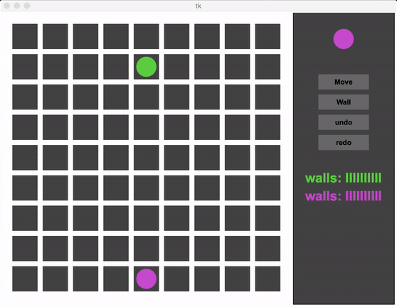

# Quoridor

## Introduction

Quoridor is a 2 or 4 player abstract strategy game. It is generally played on 9x9, 11x11 or 13x13 board. Each player has a pawn that begins at one side of the board, and the objective of the game is to move your pawn to the opposite side of the board. The twist on this simple goal is that each player has a certain number of fences that they can place anywhere on the board to hinder the other players progress. This makes the game interesting and difficult to play, because there are many possible moves and judging who is winning is not trivial. Here is comparison between Quoridor and Chess which makes this game **harder relative to Chess**:

Game     | Board Size | Space Complexity (In log base 10) | Average Game Length (plies) | Branching Factor
-------- |:-----:|:----------------:|:-------------:|:---------:
Chess    | 64    | 47               | 70            | 35       
Quoridor | 81    | 42               | 91            | 60       

***Source:*** https://en.wikipedia.org/wiki/Game_complexity

## AI Used

Implemented **MiniMax with Alpha-Beta pruning** with optimized Heuristics and achieved **5-ply** on 9x9 board.

Evaluation function consists of shortest distance from BOT to it's goal and opponent to it's goal, number of walls that BOT has and that opponent has, and there is also huge penalty/incentive for reaching the goal state. Parameters were constant in this implementation.

Current TkBoard implementation support only 9x9 board but BOT is configured for all 3 sets of board mentioned in Introduction.

## Possible Improvements

There are couple of improvements that can be done over this implementation:

* Standard openings and end game Tactics can be included, like Reed opening, Shiller opening can be used here.
* Parameters can be optimized for Evaluation function by self-learning, as we can make BOT play against itself.
* We can think of better Heuristics, like placing walls defensively or construct some special patterns of walls in specific conditions which will help you to not get blocked and increase shortest path for opponent.

## How to Use

1. Clone this repo using *git clone https://github.com/kautsiitd/Games-and-BOTS.git* or directly download zip file from above.
2. Open three terminals separately.
3. Run **./compile.sh** in any terminal to compile required files
4. Run **python TkBoard.py** in first terminal
5. Run **./run1.sh 127.0.0.1 12345** or **./client 127.0.0.1 12345** in second terminal
6. ***For BOT v/s BOT*** Run **./run1.sh 127.0.0.1 12345** or **./client 127.0.0.1 12345** in third terminal
6. ***For BOT v/s Human*** Run **./human.sh 127.0.0.1 12345"** in third terminal

and follow **Rules** section to look into how to play.

**Dependencies:** Only python >= 2.7.3 is required. Other dependencies is already included in folder.

## How To Play
Games rules can be found out here on [Wikipedia](https://en.wikipedia.org/wiki/Quoridor). Here is detail description of how you can play against BOT using terminal.

The format for sending a move is: **MoveType Row Column**

  * MoveType:
    * 0 for moving the pawn
    * 1 for horizontal wall
    * 2 for vertical wall

  * Row: [2,9]
  * Column: [2,9]

  **NOTE:**
  * When you send the row and column for wall, you are specifying the center of the wall. So values for row and column will be in the range [2,9].
  * A pawn can move only one step at a time and cannot move diagonally. If the opponent’s pawn is on the way, your pawn can jump over the opponent’s pawn. In such a case, you need to specify the values for the final position. If you specify the position where the opponent’s pawn is present, it will be considered as an invalid move.

  *e.g. If A is at (2,5) and B is at (3,5) and I need to make a move that jumps over B, then I need to send (4,5) to the
  server and not (3,5). Sending (3, 5) will be considered invalid.*

# Tic Tac Toe

It's simple Tic Tac Toe game with little bit different rules(See *Rules To Win* section), of **nxn** board size where board size and win length is customizable. I am using simple **BFS over search space of possible moves** but in adHoc manner, in it's BOT's AI implementation which let me achieved **3-ply**.

## How to Use

1. Clone this repo using *git clone https://github.com/kautsiitd/Games-and-BOTS.git* or directly download zip file from above.
2. Go to *Tic Tac Toe* folder in terminal and simply run **python human\ vs\ computer.py**.
3. Enter required fields to start game:
  * **Grid Size:** It's variable size Tic Tac Toe. So you can choose grid size in which you want to play Tic Tac Toe against computer.
  * **Win Length:** You can also choose win length. Please follow rules section for more detail

**Note:** I would suggest to play on **6x6 Board** (Grid Size: 6) with **Win Length: 5** for newer and unbiased experience. You can also play on **3x3 Board** (Grid Size: 3) with **Win Length: 3** but that would be pretty standard one. ***Please follow Rules section because it's not normal Tic Tac Toe. ;)***

**Dependencies:** Only python >= 2.7.3 is required. Other dependencies is already included in folder.

## Rules To Win

1. Either **any Column** or **any Row** have number of crosses or circles equal to **Win Length**.
2. Either **Main Diagonals** have number of crosses or circles equal to **Win Length**.
3. ***It's not necessary*** that while counting for Rule 1 or 2, ***they have to be continuous.***

# 2048

This is a Single Player game in which final aim is to achieve a cell of value **2048**. In each move player can move all cells left, right, up and down, and if there are two cells of same value are touching by edge then they will merge and form one cell of double value in direction of movement of cells. All other cells will move in the direction selected by player till the point they can move.

## How to Use

1. Clone this repo using *git clone https://github.com/kautsiitd/Games-and-BOTS.git* or directly download zip file from above.
2. Go to *2048* folder in terminal and simply run **python 2048.py**.
3. Enter Board size in which you want to play this game. Although board size >= 4 should be preferred.
4. Possible Moves: It follows same structure as in there on side keypad in laptop. You just choose a move among these, enter it in terminal and press enter to execute it.

  * 2: Move all tiles Down
  * 4: Move all tiles Left
  * 6: Move all tiles Right
  * 4: Move all tiles Up

**Note:** I would suggest to play on **6x6 Board** (Grid Size: 6) with **Win Length: 5** for newer and unbiased experience. You can also play on **3x3 Board** (Grid Size: 3) with **Win Length: 3** but that would be pretty standard one. ***Please follow Rules section because it's not normal Tic Tac Toe. ;)***

**Dependencies:** Only python >= 2.7.3 is required. Other dependencies is already included in folder.

# Need Help/Issues

If you find some issue or require some help then you can report about it in [Issues](https://github.com/kautsiitd/Games-and-BOTS/issues).
