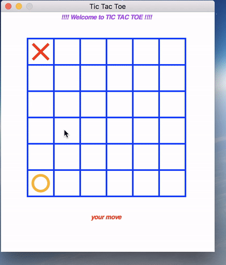

# Tic Tac Toe

It's simple Tic Tac Toe game with little bit different rules(See *Rules To Win* section), of **nxn** board size where board size and win length is customizable. I am using simple **BFS over search space of possible moves** but in adHoc manner, in it's BOT's AI implementation which let me achieved **3-ply**.

## How to Use

1. Clone this repo using *git clone https://github.com/kautsiitd/Games-and-BOTS.git* or directly download zip file from above.
2. Go to *Tic Tac Toe* folder in terminal and simply run **python human\ vs\ computer.py**.
3. Enter required fields to start game:
  * **Grid Size:** It's variable size Tic Tac Toe. So you can choose grid size in which you want to play Tic Tac Toe against computer.
  * **Win Length:** You can also choose win length. Please follow rules section for more detail

**Note:** I would suggest to play on **6x6 Board** (Grid Size: 6) with **Win Length: 5** for newer and unbiased experience. You can also play on **3x3 Board** (Grid Size: 3) with **Win Length: 3** but that would be pretty standard one. ***Please follow Rules section because it's not normal Tic Tac Toe. ;)***

**Dependencies:** Only python >= 2.7.3 is required. Other dependencies is already included in folder.

## Rules To Win

1. Either **any Column** or **any Row** have number of crosses or circles equal to **Win Length**.
2. Either **Main Diagonals** have number of crosses or circles equal to **Win Length**.
3. ***It's not necessary*** that while counting for Rule 1 or 2, ***they have to be continuous.***

## Need Help/Issues

If you find some issue or require some help then you can report about it in [Issues](https://github.com/kautsiitd/Games-and-BOTS/issues).
